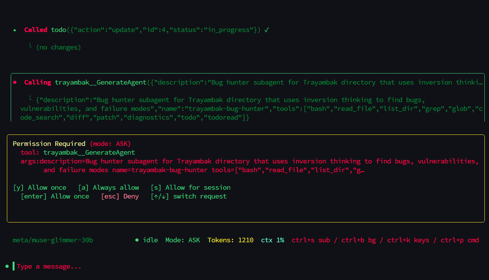
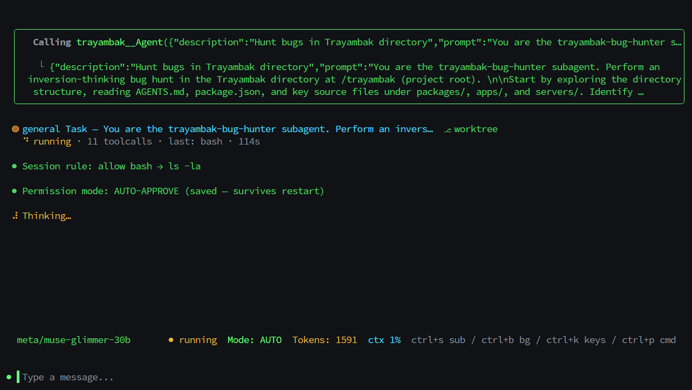

# Trayambak-cli

**Trayambak CLI** is a coding agent from SKT AI LABS that runs locally on your computer

## **What is Trayambak CLI ?**

**Trayambak CLI** is an AI agent that runs in the terminal, helping you carry out software development tasks and day-to-day terminal operations — reading and modifying code, running shell commands, searching files, fetching web pages, and autonomously planning and adjusting its next steps based on feedback as it works.

_It fits scenarios such as:_

- Writing and modifying code: implementing new features, fixing bugs, completing refactors

- Understanding a project: exploring an unfamiliar codebase and answering questions about architecture and implementation

- Automating tasks: batch-processing files, running builds and tests, chaining multiple scripts together

- Trayambak hunts bugs like it wants them dead

- The CLI is written in TypeScript, distributed via npm, and runs on Node.js

## **What's New & Different From The Rest ?**

We Used **Philosophical Methods** To Hunt Every Kinds Of **Vulnerabilities** In Lower Cost Of **Thinking Language Models**

_While others reach for **bigger models** and **larger languages** to patch **critical bugs** and **predict failures**, We take the opposite path: we ask how the agent could cause damage — then shut every one of those doors first._

---

|                                                |                       |
| :--------------------------------------------------------------------------------------------------------------------------------: | :--------------------------------------------------------------------------------------------: |
| _Here's the moment the bug-hunter subagent spins up — it flips the problem around and asks for permission before it does anything_ | _A few Seconds into a real hunt: 11 tool calls in, and the session rules haven't slipped once_ |

> **What's the actual difference?**
>
> Most agents try to tell you things will work. We'd rather find out where they don't.
>
> So instead of asking "will this run?", Trayambak asks "how does this break?" — and then sits down and proves it can't.
>
> It sounds simple, but it changes everything about how the agent works:
>
> 1. **We flip the problem first.** Before writing a single line, we ask what would make this fail — and reason backwards from there.
> 2. **We break it before we fix it.** No patch goes in until we've watched it go wrong ourselves. If we can't reproduce it, we don't touch it.
> 3. **Nothing gets a free pass.** Every claim the agent makes gets checked. If it can't show its work, it doesn't get to say it.
> 4. **It just talks like a person.** No buzzwords, no vague hand-waving — you get a straight answer you can actually read.

---

## Get Started

1. **Install Trayambak CLI**

```
npm install -g @skt-ai-labs/trayambak-cli
```

2. How To **Launch** The **CLI**

Type `skt` or `trayambak` in your terminal:

```
trayambak
```

3. **Connect** With Any **Provider**

Type `/provider` and connect with any provider:

```
/provider
```

4. Choose A **Model**

Type `/models` and pick one from the list:

```
/models
```

_Use **Trayambak** to hunt **vulnerabilities** — or to **build**._

---

## Common commands and keyboard shortcuts

_For a **first-time user**, the following is all you need to know:_

**Session commands**

| Command     | Description                                                                                    |
| ----------- | ---------------------------------------------------------------------------------------------- |
| `/newchat`  | Start a new session, clearing the current context (`/clear` does the same)                     |
| `/sessions` | Browse session history and choose one to resume                                                |
| `/model`    | Switch the current model                                                                       |
| `/provider` | Pick a backend, save its key, and switch models                                                |
| `/compact`  | Manually compress the context to free up tokens                                                |
| `/fork`     | Fire-and-forget background subagent with this turn's context (you stay in the current session) |
| `/help`     | List all built-in slash commands                                                               |
| `/keymap`   | Show every keyboard shortcut                                                                   |

> Session forking (an independent copy with full history) is the **`F` key**
> inside the `/sessions` picker — along with `r` rename, `d` delete and
> `Ctrl+A` archive.

**Most-used keyboard shortcuts**

| Shortcut            | Description                                                    |
| ------------------- | -------------------------------------------------------------- |
| `Esc`               | Interrupt streaming output / close a popup                     |
| `Ctrl-C`            | Interrupt output; press twice while idle to exit               |
| `Shift-Tab`         | Toggle Plan mode                                               |
| `Ctrl-S`            | Inject the current draft to the front of the queue, mid-stream |
| `Ctrl-O`            | Collapse / expand tool output and compaction summaries         |
| `Ctrl+K`            | Leader key — opens the which-key overlay with all shortcuts    |
| `Ctrl+P`            | Command palette                                                |
| `Ctrl+Z` / `Ctrl+Y` | Undo / redo a workspace checkpoint                             |
| `Ctrl+G` / `Ctrl+B` | Subagents panel / background tasks panel                       |
| `Ctrl+X`            | Clear queued prompts                                           |
| `Ctrl+D`            | Abort the current turn                                         |

---

## Command line reference

Run `trayambak help` for the authoritative list:

| Command                                           | Description                                                 |
| ------------------------------------------------- | ----------------------------------------------------------- |
| `trayambak`                                       | Start an interactive session (alias: `skt`)                 |
| `run "prompt"`                                    | Interactive session that runs that prompt immediately       |
| `exec "prompt"`                                   | Headless run — newline-delimited JSON events on stdout      |
| `review [target]`                                 | Review code/changes for bugs, security issues, style        |
| `commit [--staged\|--all]`                        | Draft a conventional-commit message for the diff            |
| `stats`                                           | Show usage stats (sessions, events, violations)             |
| `pr <checkout\|link\|unlink\|status>`             | Pull-request helpers via `gh`                               |
| `db <path\|summary\|threads\|violations>`         | Inspect the local state store                               |
| `uninstall`                                       | Remove launcher shims (keeps config/sessions/state)         |
| `config get [key]` / `config set <k> <v>`         | Show / persist configuration                                |
| `doctor`                                          | Diagnose the local environment                              |
| `info`                                            | Runtime & config summary                                    |
| `agent [list\|info\|run]`                         | Manage agent profiles                                       |
| `task [list\|create]`                             | Manage trayambak tasks                                      |
| `todo [list\|add\|update]`                        | Manage session todos                                        |
| `plan [create\|list\|show]`                       | Manage multi-step plans                                     |
| `manager [status\|summary]`                       | Show manager status                                         |
| `compact [config\|estimate\|run\|reset]`          | Configure/run session compaction                            |
| `mode [list\|current\|set]`                       | Switch operating modes                                      |
| `worktree [list\|create\|remove\|switch]`         | List/switch git worktrees                                   |
| `mcp [list\|auth\|logout\|status]`                | Manage MCP servers & OAuth                                  |
| `marketplace <list\|search\|install\|remove>`     | Browse/install shareable skills & agents                    |
| `upgrade [version]`                               | Update trayambak (git/npm) and rebuild                      |
| `serve [--port 8080]`                             | Start a local llama.cpp server                              |
| `download <org/model>`                            | Download a GGUF model                                       |
| `acp`                                             | Run as an ACP agent server (stdio JSON-RPC)                 |
| `web [--port 8787]`                               | HTTP agent API + `/api/sessions` + `/openapi.json`          |
| `login [--with-api-key K\|status]` / `logout`     | Store or delete credentials                                 |
| `archive <id>` / `unarchive <id>` / `delete <id>` | Manage saved sessions                                       |
| `mcp-server`                                      | Run an MCP server (tools over stdio)                        |
| `sandbox check <file>`                            | Check the sandbox policy for a file                         |
| `execpolicy check <cmd>`                          | Check the exec policy for a command                         |
| `resume <id>`                                     | Resume a stored session                                     |
| `export [id] [--format markdown\|json\|text]`     | Export a session transcript (default `markdown`)            |
| `completion <bash\|zsh\|fish\|powershell>`        | Print a shell completion script to source from your profile |

**Global flags:** `--base-url <url>`, `--model <name>`, `--provider <name>`
(`llamacpp`, `nvidia`, `nvidia-nim`, `openai`, `xai`, `huggingface`,
`anthropic`, `google`, `ollama`, `custom`), `--cwd <dir>`, `--session <file>`,
`--port <n>`, `--host <addr>`, `--dev`, `--dump-system-prompt`,
`--version`/`-v`, `--help`/`-h`. Shorthands: `-p` prompt, `-m` model,
`-c` cwd; `--no-<flag>` sets a flag to `false`.

---


## Models 

Currently Our **SKT Console** in Maninatance so We Will Start Our Models free Usages later.


## Configuration reference

Config file: `./.trayambak/config.json` when a `.trayambak/` directory exists
in the current directory, otherwise `~/.trayambak/config.json` — written
atomically with `0600` permissions and a `.bak` rotation. Schema:
[`config.schema.json`](config.schema.json).

**Precedence (lowest → highest):** built-in defaults < config file <
`TRAYAMBAK_*` environment variables < CLI flags.

```sh
trayambak config get              # dump every effective value
trayambak config get model        # one value
trayambak config set model gpt-4o # persist (numbers/booleans coerced)
trayambak config set provider openai
```

**Key environment variables** (full list in
[docs/getting-started.md](docs/getting-started.md#configuration)):

| Variable                       | Sets                                                  |
| ------------------------------ | ----------------------------------------------------- |
| `TRAYAMBAK_BASE_URL`           | Provider base URL                                     |
| `TRAYAMBAK_MODEL`              | Model id                                              |
| `TRAYAMBAK_SMALL_MODEL`        | Cheap model for background chores (auto-titles)       |
| `TRAYAMBAK_SUBAGENT_MODEL`     | Default model for subagent children                   |
| `TRAYAMBAK_API_KEY`            | API key (beats the config file)                       |
| `TRAYAMBAK_PROVIDER`           | Provider id                                           |
| `TRAYAMBAK_CWD`                | Working directory for tools                           |
| `TRAYAMBAK_CONTEXT_WINDOW`     | Context window driving compaction                     |
| `TRAYAMBAK_MCP_SERVERS`        | MCP servers as JSON                                   |
| `TRAYAMBAK_WEB_TOKEN`          | Bearer token for `trayambak web`                      |
| `TRAYAMBAK_WEB_ORIGINS`        | Extra browser origins for `trayambak web` (`*` = any) |
| `TRAYAMBAK_AUTOUPDATE`         | `true` / `false` / `notify`                           |
| `TRAYAMBAK_DISABLE_AUTOUPDATE` | Auto-update kill switch                               |

---

## Exit codes

| Code | Meaning                                                                                                                                                             |
| ---- | ------------------------------------------------------------------------------------------------------------------------------------------------------------------- |
| `0`  | Success — including `--help`, `--version`, and `config` usage output                                                                                                |
| `1`  | Failure — unhandled exception (logged to the mistake journal first), failed `doctor` checks, MCP CLI errors                                                         |
| `2`  | Usage error — unknown command, unknown `help` target, missing argument (e.g. `resume <id>`), unknown/missing flag, invalid `--port`, `--format`, or `--shell` value |

The constants live in [`apps/cli/src/command-registry.ts`](apps/cli/src/command-registry.ts)
as `EXIT_OK` / `EXIT_ERROR` / `EXIT_USAGE`; usage failures are raised as
`EarlyExit(2)` from `usageAbort()` in [`apps/cli/src/index.ts`](apps/cli/src/index.ts).
The `mcp` subcommand follows the same scheme: usage failures (unknown
action, missing server name) exit `2`; operational failures (OAuth flow
errors, config problems) exit `1` (`apps/cli/src/commands/mcp.ts`).

---

## Architecture overview

Trayambak is a TypeScript monorepo that compiles to `dist/` and ships on npm
as `@skt-ai-labs/trayambak-cli` (bins `trayambak` and `skt`):

- **`apps/cli`** — the CLI entry: subcommands, flags, session commands.
- **`apps/runtime`** — the agent: config loader, agent loop, tools, prompts,
  auto-update.
- **`packages/*`** — protocol types, provider adapters (22 backends), the Ink
  TUI, MCP client/server, ACP, HTTP server, SDK, sandbox, session backends,
  telemetry.
- **`skt/`** — internal numbered subsystems: mistake memory, eval loop,
  memory, control, healing, hooks.

The build runs `tsc` (main), `tsc -p tsconfig.ink.json` (the Ink UI as ESM),
then an asset-copy + `fix-esm-imports.js` flatten step. Full walkthrough:
[docs/architecture.md](docs/architecture.md).

---

## Troubleshooting

Something not working? Start with the built-in doctor:

```sh
trayambak doctor   # Node, config, model, llama.cpp binary, endpoint reachability
trayambak info     # version, node, platform, cwd, baseUrl, model, shell
```

Then see **[docs/troubleshooting.md](docs/troubleshooting.md)** for the usual
suspects — 401s and prefixed keys, Ollama not running, a missing llama.cpp
binary, the wrong config file, web-server 401s, MCP timeouts, and stale
builds.

---

## Bug reporting

Found a bug? Reports that follow this flow get fixed fastest:

1. **Security vulnerability? Stop — report privately.** Do not open a
   public issue. Report directly to support@sktailabs.in
   with: affected version, reproduction steps, impact, and logs with
   secrets redacted ([SECURITY.md](SECURITY.md): acknowledgement within
   3 business days, fix timeline within 14 days for confirmed
   High/Critical, 90-day coordinated-disclosure window).
2. **Regular bug? Open a public issue** at
   <https://github.com/SKT-AI-LABS/Trayambak-cli/issues> with:
   - Title + severity (`CRITICAL` / `HIGH` / `MEDIUM` / `LOW`)
   - Version and platform (`trayambak info`: version, node, platform)
   - Minimal reproduction steps and minimal repro input
   - Expected vs actual behaviour, with evidence (output, logs)
   - Secrets redacted from everything you paste — never paste tokens,
     `0600` files, or `mcp-auth.json` contents

Triage is severity-first: crash, data-loss, and security-adjacent
`CRITICAL`–`HIGH` reports jump the queue, and anything with a failing
reproduction beats a description-only report.

---

## Documentation

| Doc                                        | Contents                                                         |
| ------------------------------------------ | ---------------------------------------------------------------- |
| [Getting started](docs/getting-started.md) | Install, first session, subcommands, flags, config, env vars     |
| [Sessions](docs/sessions.md)               | Transcript storage, resume/fork/archive, compaction, checkpoints |
| [Providers](docs/providers.md)             | All 22 backends, key handling, local models                      |
| [MCP](docs/mcp.md)                         | MCP servers, OAuth, connector registry, `mcp-server`             |
| [ACP](docs/acp.md)                         | Editor integration over stdio JSON-RPC                           |
| [Web](docs/web.md)                         | Local HTTP agent API, SSE, token auth                            |
| [Security](docs/security.md)               | Permissions, sandbox, secret storage                             |
| [Troubleshooting](docs/troubleshooting.md) | Diagnosis and fixes                                              |
| [Architecture](docs/architecture.md)       | Monorepo layout, build pipeline, CI                              |
| [Docs index](docs/README.md)               | Quick reference for everything above                             |

---

## Security

Found a vulnerability? **open a public issue** — the reporting process,
supported versions, scope, and disclosure window are in
[SECURITY.md](SECURITY.md). Highlights: secrets are stored `0600` and
atomic, telemetry is off by default, and destructive shell commands are
denied by default with writes asking for approval
([docs/security.md](docs/security.md)).

**License For Devmodes are Opnened It's free no charge for **individual developer** But its only for security and testing of your infrastucture to safe your infrastucture We Will Only Track Pentest Tools Usages to Create a safer community. Companies required To Contact Us and get it they require a plan*
---

## License

Trayambak CLI is **proprietary software** developed and maintained by
**SKT AI LABS PRIVATE LIMITED**, licensed under the
**Trayambak CLI Proprietary License** — see [LICENSE](LICENSE) for the full
terms. You get a limited, non-exclusive, non-transferable licence to use the
software for your own lawful purposes; copying, modification, redistribution,
and reverse engineering (beyond where prohibited by law) require prior
written permission. Not open source, and not Apache-licensed.
